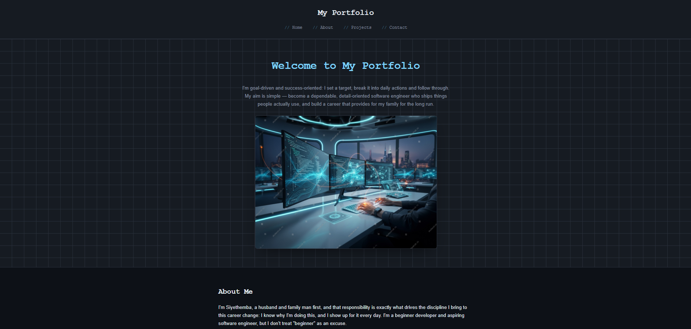
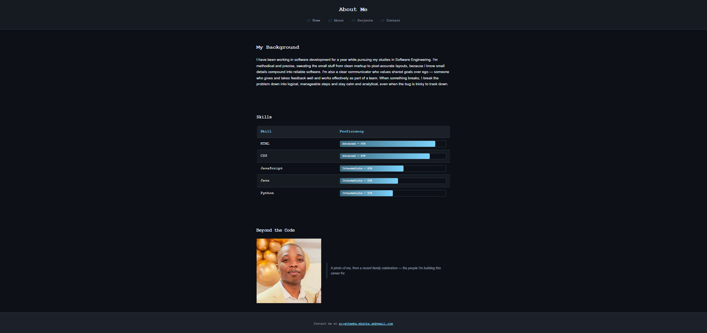
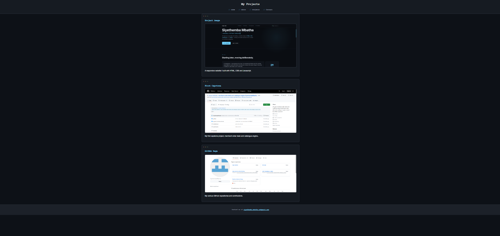
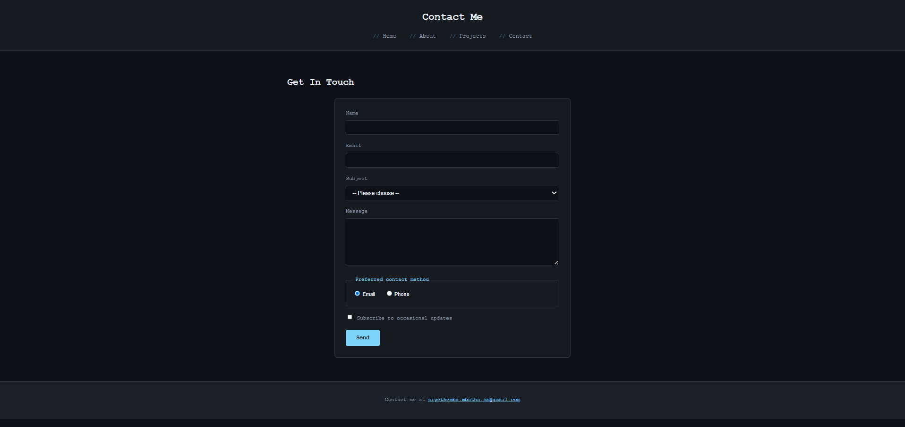
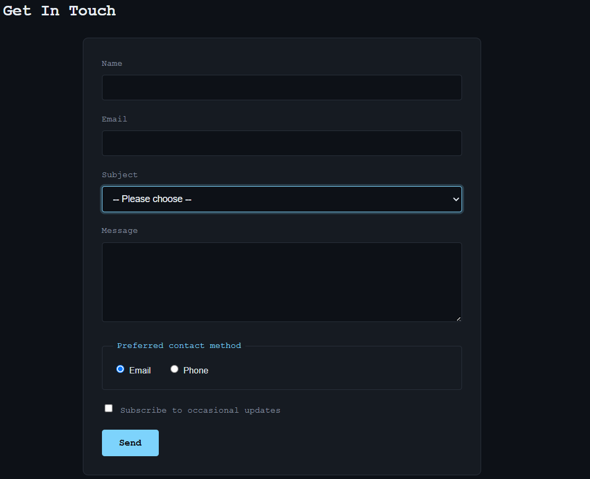
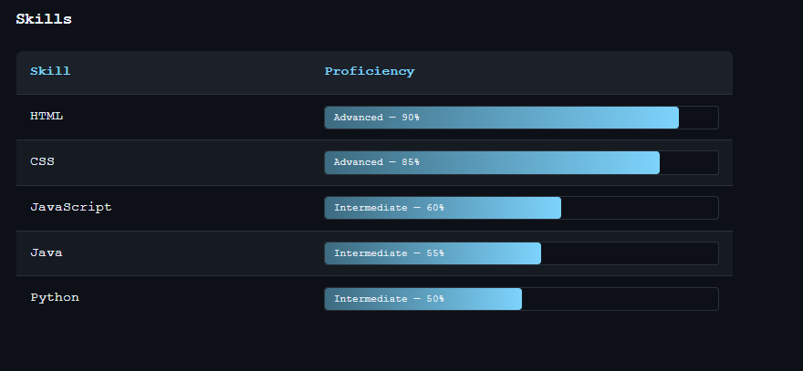

# Portfolio Website — Capstone 2: Debug Portfolio Website

## Overview

This is a personal portfolio website built with HTML and CSS as part of my capstone 2 project to debug, complete, and enhance a starter codebase provided for the assignment. The site includes four pages — Home, About, Projects, and Contact — showcasing who I am, my skills, my projects, and a way to get in touch. Beyond fixing the intentional errors in the starter code, I extended the project with a custom dark, code-editor-inspired theme, animated skill proficiency bars, and personalized content throughout.

## Issues Found

The starter code contained 41 intentional errors across the HTML and CSS files. Key issues included: generic `
` elements used instead of semantic HTML5 tags (`header`, `nav`, `main`, `section`, `footer`); no working navigation menu on any page; missing `lang`, charset, and viewport meta tags; images with no `alt` attributes; a completely missing data table on the About page; only two projects instead of the required three; a contact form with no labels, limited input types, and no validation; and a stylesheet using only two selector types with no pseudo-classes, minimal box model usage, and a misaligned footer. A full breakdown is available in `design/issues-identified.md`.

## Fixes Implemented

I restructured all four HTML pages using proper semantic elements and added a consistent, working navigation menu linking all pages together (16 total working links). All images now have descriptive `alt` text. I built the missing skills table on the About page — enhanced further with CSS-driven proficiency bars — and added a third project to the Projects page. The contact form was rebuilt with labels for every field, five input types (text, email, select, textarea, radio/checkbox), and HTML5 validation attributes (`required`, `minlength`). On the CSS side, I expanded to five or more selector types (element, class, descendant, pseudo-class, attribute), added consistent box model usage throughout, fixed the footer alignment with flexbox, and introduced a responsive media query.

## HTML Structure & CSS Approach

Each page follows a consistent semantic structure: a `header` containing the page heading and site-wide `nav`, a `main` element wrapping the page's core content in `section` or `article` elements, and a `footer` with contact details. I avoided non-semantic div elements entirely, using 
 tags to group form fields instead, since a paragraph is a more appropriate semantic container than a generic div for this purpose.

For CSS, I organised the stylesheet into clearly commented sections (base styles, header/nav, hero, sections, table, project cards, form, footer, responsive). I used CSS custom properties (`:root` variables) to keep the colour palette and spacing consistent and easy to maintain, and layered in pseudo-classes (`:hover`, `:focus`, `:nth-child`) and pseudo-elements (`::before`) for interactive polish — including a CSS-only skill proficiency bar system driven entirely by a custom property (`--pct`) rather than JavaScript.

## Accessibility Improvements

All images include descriptive `alt` text. Every form input has an explicitly associated `<label>` using matching `for`/`id` attributes, and the contact-method radio buttons are grouped inside a `<fieldset>` with a `<legend>` for context. The skill proficiency bars include `role="progressbar"` with `aria-valuenow`, `aria-valuemin`, `aria-valuemax`, and `aria-label` attributes so the visual bars remain meaningful to screen reader users. I verified all text/background colour combinations against the WCAG 4.5:1 contrast ratio using the WebAIM Contrast Checker, and every pairing passed comfortably. A `prefers-reduced-motion` media query is also included to reduce animation for users who have that preference set.

## How to View

1. Clone this repository: `git clone https://github.com/SiyethembaMbatha/Portfolio-Website-Debug.git`
2. Open the folder in your code editor or file explorer.
3. Double-click `index.html` to open it directly in your browser, or use a tool such as VS Code's Live Server extension for the best experience.
4. Navigate between pages using the menu at the top of the site (Home, About, Projects, Contact).

## Screenshots

**Homepage**

**About Page**

**Projects Page**

**Contact Page**

**Contact Form (detail)**

**Skills Table (detail)**

**Navigation Hover State**

## Reflection

The biggest challenge in debugging the starter code was spotting issues that weren't immediately obvious from just viewing the page in a browser — for example, the missing `alt` attributes and lack of form labels didn't visually break anything, but they were significant accessibility gaps. Running the code through the W3C validators helped catch structural issues I might have otherwise missed. Another challenge was reworking the CSS to a completely different visual theme partway through the project without breaking the underlying HTML structure or accessibility requirements — this required re-testing colour contrast ratios from scratch after changing the entire palette. Working through this project reinforced how much of "good" front-end code is invisible to a casual glance but matters enormously for accessibility, maintainability, and code quality.